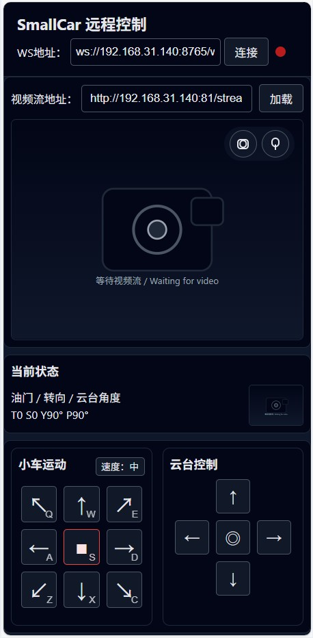
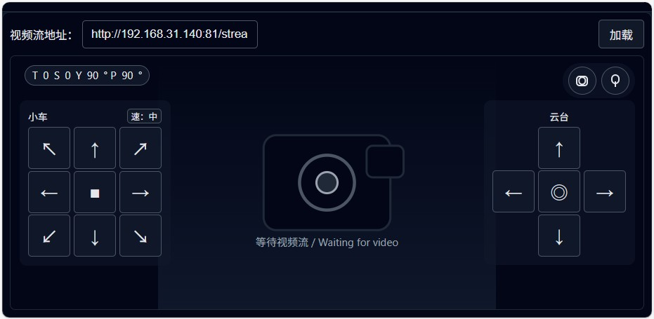

# 远程控制架构（ESP32-CAM + UART）

> 本文描述 smallcar 工程中，从网页端经由 ESP32-CAM，到 STM32F103C8T6 小车主控的完整远程控制链路，以及 STM32 侧使用的简单 UART 文本协议。

---

## 1. 总体架构（概览）

当前与规划中的控制链路如下：

```text
浏览器（Web UI）
    ↓ WebSocket / HTTP（局域网）
ESP32-CAM（视频 + 控制网关）
    ↓ UART（3.3V TTL，ASCII 协议行）
STM32F103C8T6（smallcar_keil 固件）
    ↓
电机驱动 TB6612 + 双舵机云台
```

- **浏览器 / Web UI**（待实现）：
  - 显示来自 ESP32-CAM 的视频流；
  - 提供虚拟摇杆 / 按钮，生成油门、转向、云台角度等控制量；
  - 通过 WebSocket 以 JSON 形式把控制命令发给 ESP32-CAM。

- **ESP32-CAM**（待硬件到货后实现）：
  - 运行摄像头 Web 服务器，向浏览器推送视频；
  - 暴露 WebSocket 控制端点，接收 JSON 控制消息；
  - 将 JSON 字段转换为精简的 UART 文本指令行，发送给 STM32。

- **STM32F103C8T6**（已在 `smallcar_keil/main.c` 中实现）：
  - 保留现有 PS2 本地遥控逻辑不变；
  - 在 USART1 上监听 ASCII 串口控制命令；
  - 当存在“最近有效”的远程命令时，覆盖 PS2 对电机和云台的输出。
 
---

## 2. UART 串口命令协议（STM32 侧）

STM32 通过 **USART1（PA9/PA10，115200 8N1）** 接收远程控制指令，约定每一行一条命令，格式如下：

```text
C,<throttle>,<steer>,<yaw>,<pitch>\n
```

- 行首固定为 `C`（Control），大小写不敏感（`c` 也接受）；  
- 字段之间用英文逗号 `,` 分隔，均为 ASCII 十进制整数；  
- 每行以 `\n` 或 `\r\n` 结束。**注意：使用串口调试软件（如 COMTool）时，需要勾选“newline/CRLF”等选项，或手动在结尾发送回车，否则 STM32 不会认为一行命令已经结束，也就不会解析。**

### 2.1 字段含义与取值范围

- **`throttle`**（油门，`int`，`-100 .. 100`）：  
  - `> 0`：前进油门；  
  - `< 0`：后退油门；  
  - `0`：油门为 0（不对速度产生贡献）；  
  - STM32 会再乘以当前 `speed_percent`（60/80/100），效果类似 PS2 挡位控制。

- **`steer`**（转向，`int`，`-100 .. 100`）：  
  - `-100`：最大左转；  
  - `0`：直行；  
  - `+100`：最大右转；  
  - STM32 将其映射到已有的 `k_turn` 差速转向逻辑中。

- **`yaw`**（云台水平角，`int`，`-1` 或 `0 .. 180`）：  
  - `-1`：保持当前 Yaw 角度不变；  
  - `0..180`：目标绝对角度（单位：度）；  
  - 在应用前会夹在 `[YAW_MIN_ANGLE, YAW_MAX_ANGLE]` 范围内。

- **`pitch`**（云台俯仰角，`int`，`-1` 或 `0 .. 180`）：  
  - `-1`：保持当前 Pitch 角度不变；  
  - `0..180`：目标绝对角度；  
  - 在应用前会夹在 `[PITCH_MIN_ANGLE, PITCH_MAX_ANGLE]` 范围内。

### 2.2 示例命令

- 中等油门直行，不改变云台角度：

```text
C,50,0,-1,-1\n
```

- 带一定油门的原地左转（有转向，云台不变）：

```text
C,40,-100,-1,-1\n
```

- 只把云台回到 90/90，不移动小车：

```text
C,0,0,90,90\n
```

---

## 3. STM32 固件行为（概述）

本功能在 `smallcar_keil/main.c` 中实现，核心要点如下。

### 3.1 USART1 配置

- 外设：APB2 总线上的 **USART1**；  
- 引脚（详见 `doc/pins.md`）：  
  - `PA9`：USART1_TX（AF 推挽输出，50 MHz）；  
  - `PA10`：USART1_RX（输入，浮空）；  
- 波特率：72 MHz 系统时钟下 **115200 8N1**（`USART1->BRR = 0x0271`）；  
- 使能接收中断（`RXNEIE`），中断服务函数为 `USART1_IRQHandler`。

### 3.2 接收缓冲与行解析

- 使用一个长度为 `UART_RX_BUF_SIZE = 64` 的字符缓冲接收串口数据；  
- 中断中逐字节写入缓冲；遇到 `\n` 或 `\r` 时视为一行结束：  
  - 在线尾补 `"\0"`，得到 C 风格字符串；  
  - 如果行首是 `C`/`c`，调用 `UART_ParseLine()` 解析。  
- `UART_ParseLine()` 用 `strtol` 依次提取 4 个整数，并对取值做限幅，解析成功后写入全局结构体 `RemoteCmd_t`：

```c
typedef struct
{
    int16_t throttle;   // -100..100
    int16_t steer;      // -100..100
    int16_t yaw;        // -1 or 0..180
    int16_t pitch;      // -1 or 0..180
    uint8_t valid;      // 解析成功后置 1
    uint32_t last_tick; // 记录接收时的主循环计数
} RemoteCmd_t;
```

- 主循环中有一个 `g_loop_counter` 计数器，每次循环 +1；  
- 每成功解析一行时，将 `g_remote_cmd.last_tick` 更新为当前 `g_loop_counter`，并将 `valid` 置 1。

### 3.3 超时与优先级

在主循环中，先按原有 PS2 逻辑计算并下发电机与云台控制，然后再检查是否有 **最近的远程命令**：

- 若 `g_remote_cmd.valid == 1`，且 `g_loop_counter - g_remote_cmd.last_tick <= REMOTE_TIMEOUT_LOOPS`  
  （默认 `REMOTE_TIMEOUT_LOOPS = 50`，对应当前 20ms 延时大约 1 秒超时），则认为远程命令“仍然有效”，进入远程覆盖分支；  
- 否则忽略远程命令，仅保留 PS2 控制效果。

当远程命令有效时：

- 小车运动：  
  - 使用远程的 `throttle` / `steer`，通过现有的 `k_turn` 差速公式计算左右轮命令 `left_cmd/right_cmd`；  
  - 指令范围被夹在 `[-100, 100]` 内，再调用 `Motor_SetLR(left_cmd, right_cmd)` 输出。  

- 云台控制：  
  - 若 `yaw >= 0`，将其夹在 `[YAW_MIN_ANGLE, YAW_MAX_ANGLE]` 内，写入 `yaw_angle`；  
  - 若 `pitch >= 0`，将其夹在 `[PITCH_MIN_ANGLE, PITCH_MAX_ANGLE]` 内，写入 `pitch_angle`；  
  - 最后调用 `Servo_SetYawAngle(yaw_angle)` 与 `Servo_SetPitchAngle(pitch_angle)` 更新两个舵机。  

总结来说：**在有“最近有效”的远程命令时，远程控制会覆盖 PS2 对电机和云台的输出；在超时或未收到远程命令时，则完全按原有 PS2 控制逻辑运行。**

---

## 4. ESP32-CAM 集成规划（简要）

当 ESP32-CAM 模块到货后，它将作为“网络网关 + 视频源”接入到上述架构中，职责大致如下：

- 在 ESP32 上运行摄像头 Web 服务器，为浏览器提供实时视频流（例如 MJPEG 等方式）；  
- 暴露一个 WebSocket 控制端点（例如 `ws://ESP32_IP:PORT/ws_control`）；  
- 接收来自浏览器的 JSON 控制消息，例如：

```jsonc
{
  "type": "control",
  "throttle": -100, // -100..100
  "steer": 0,       // -100..100
  "yaw": -1,        // -1 或 0..180
  "pitch": -1       // -1 或 0..180
}
```

- 将 JSON 中的字段转换为 UART 文本命令 `C,thr,steer,yaw,pitch\n`，通过 USART1 发送给 STM32；  
- 同时继续提供视频流接口，供浏览器页面中的 `` 或其它播放器组件使用。

浏览器侧的 Web UI 只需要：

- 作为静态 HTML/JS 页面部署在任意一台 Linux 主机 / 路由器 / NAS 上；  
- 打开页面后，通过 JavaScript 建立到 ESP32-CAM 的 WebSocket 连接；  
- 根据用户操作（虚拟摇杆、按键等）周期性地发送上述 JSON 控制消息即可。

在这种设计下，STM32 固件始终只需要理解一种非常简单的 UART 协议，不关心网络层和网页实现细节，后续要更换 Web UI 或上位机实现也会比较轻松。

---

## 5. ESP32-CAM 固件实现要点

ESP32-CAM 端的固件在 `esp32_cam/CameraWebServer/CameraWebServer.ino` 与 `app_httpd.cpp` 中实现，核心职责：

- 通过 Wi-Fi 加入局域网；
- 提供摄像头 HTTP 服务（视频流 + 拍照 + 参数控制）；
- 启动一个 WebSocket 服务器，接收来自 Web UI 的 JSON 控制指令；
- 将 JSON 指令转换为 STM32 所需的 UART 文本命令 `C,thr,steer,yaw,pitch\n` 并通过 `Serial2` 下发。

### 5.1 UART 接口

- 使用 `Serial2` 作为控制串口：

  ```cpp
  static const int UART_RX_PIN = 12;   // 连接 STM32 PA10 (USART1_RX)
  static const int UART_TX_PIN = 13;   // 连接 STM32 PA9  (USART1_TX)
  static const unsigned long UART_BAUD = 115200;

  HardwareSerial &ControlSerial = Serial2;

  ControlSerial.begin(UART_BAUD, SERIAL_8N1, UART_RX_PIN, UART_TX_PIN);
  ```

- 波特率与 STM32 一致：**115200 8N1**。

### 5.2 WebSocket 控制通道（单客户端占用）

- 监听端口：`8765`；
- 默认控制地址示例：`ws://<ESP32_IP>:8765/ws_control`；
- 使用 `WebSocketsServer controlWs(8765);`，事件回调：

  ```cpp
  void onWsEvent(uint8_t num, WStype_t type, uint8_t *payload, size_t length) {
    // WStype_CONNECTED / WStype_DISCONNECTED / WStype_TEXT
  }
  ```

- **单客户端占用控制权**：
  - 当有新客户端连接时，如果之前已有控制客户端，则旧客户端会被 `disconnect()` 掉；
  - 只有当前持有控制权的客户端发送的文本帧会被用于生成 UART 命令。

### 5.3 JSON → UART 文本桥接

处理函数 `handleControlJson()`：

```cpp
void handleControlJson(const char *data, size_t len) {
  StaticJsonDocument<256> doc;
  DeserializationError err = deserializeJson(doc, data, len);
  if (err) {
    return;
  }

  const char *type = doc["type"];
  if (!type || strcmp(type, "control") != 0) {
    return;
  }

  int throttle = doc["throttle"] | 0;
  int steer    = doc["steer"]    | 0;
  int yaw      = doc["yaw"]      | -1;
  int pitch    = doc["pitch"]    | -1;

  throttle = constrain(throttle, -100, 100);
  steer    = constrain(steer,    -100, 100);
  // yaw/pitch 在 [-1, 180] 范围内裁剪

  char buf[64];
  int n = snprintf(buf, sizeof(buf), "C,%d,%d,%d,%d\n", throttle, steer, yaw, pitch);
  if (n > 0) {
    ControlSerial.write((const uint8_t *)buf, n);  // 发送给 STM32
  }
}
```

对应 Web UI 侧的 JSON 结构参见下文 6.1。

### 5.4 摄像头 HTTP 接口

在 `app_httpd.cpp` 中，沿用官方 CameraWebServer 的 HTTP 端点（基于 `httpd`）：

- `GET /`：内置摄像头调试页面（原生 UI，可选）；
- `GET /stream`：MJPEG 视频流（通常监听在端口 `81`）；
- `GET /capture`：抓拍一张 JPEG 图片（便于 Web UI 显示缩略图）；
- `GET /control?var=...&val=...`：设置摄像头参数/补光灯等，其中：
  - `var=led_intensity&val=0..255`：控制 ESP32-CAM 补光灯亮度；

抓拍时补光灯的逻辑：

- 若灯当前由 `led_intensity` 打开，则 `/capture` 在拍照时**不会强制关灯**，避免肉眼可见闪烁；
- 若灯当前关闭，则 `/capture` 会在拍照前短暂点亮再关闭，以保证画面亮度。

---

## 6. Web UI 与 iStoreOS 部署

### 6.1 Web UI 功能与配置

Web 前端位于 `web/` 目录：

- `index.html`：布局结构（视频预览、当前状态、控制面板等）；
- `style.css`：响应式样式、按钮和图标；
- `main.js`：WebSocket 控制逻辑、虚拟摇杆/按键、视频加载、拍照与补光灯控制。

#### 6.1.1 WebSocket 与视频流地址

在 `index.html` 顶部工具栏中可以直接配置：

- **WebSocket 地址**（默认示例）：

  ```text
  ws://192.168.31.140:8765/ws_control
  ```

  根据实际 ESP32-CAM IP 修改即可，例如：

  ```text
  ws://<ESP32_IP>:8765/ws_control
  ```

- **视频流地址**（默认示例）：

  ```text
  http://192.168.31.140:81/stream
  ```

  一般形式为：

  ```text
  http://<ESP32_IP>:81/stream
  ```

在 `main.js` 中：

- WebSocket 以 `JSON` 向 ESP32-CAM 周期性发送控制消息（约每 100ms 一次）：

  ```jsonc
  {
    "type": "control",
    "throttle": 0,   // -100..100
    "steer": 0,      // -100..100
    "yaw": 90,       // 绝对角度，15..165
    "pitch": 90      // 绝对角度，15..150
  }
  ```

- Yaw/Pitch 的 UI 限幅与 STM32 固件保持一致：
  - `YAW_MIN = 15, YAW_MAX = 165`；
  - `PITCH_MIN = 15, PITCH_MAX = 150`。

#### 6.1.2 拍照与补光灯

- 视频右上角的拍照按钮：
  - 根据视频流地址推导 `http://<ESP32_IP>/capture`；
  - 抓拍结果仅用于更新“当前状态”卡片右侧缩略图，不再新开标签页；
  - 点击缩略图会在当前页面弹出大图预览，支持长按/右键保存。

- 灯光按钮：
  - 根据视频流地址推导 `http://<ESP32_IP>/control?var=led_intensity&val=0|255`；
  - 使用 `fetch(..., { mode: "no-cors" })` 触发请求，只控制亮灭状态，不关心返回内容。

#### 6.1.3 UI 布局示意与截图

Web UI 主要由三块组成：

- 顶部：连接状态与配置
  - 左侧：标题 `SmallCar 远程控制`；
  - 右侧：WebSocket 地址输入框 + 连接按钮 + 彩色状态灯（未连接/已连接/错误）。
- 中间：视频预览 + 悬浮控制
  - 大面积视频框，用 `` 播放 `http://<ESP32_IP>:81/stream`；
  - 右上角悬浮拍照 / 开灯按钮；
  - 在手机横屏且高度较小时，会在视频上显示两个半透明控制面板：左侧为小车方向键，右侧为云台方向键，上方有一个当前油门/转向/云台角度的状态气泡。
- 底部：详细控制面板
  - 左侧：小车运动（8 向按键 + 速度挡位）；
  - 右侧：云台控制（方向按键 + 滑块角度显示）；
  - 中间有“当前状态”卡片，左侧显示 T/S/Y/P 数值，右侧为最近拍照缩略图。

当前仓库中在 `doc/image/` 下已经包含三张实际运行截图：





### 6.2 在 iStoreOS / OpenWrt 上部署 Web UI

为了方便在路由器上长期运行 Web 控制面板，本仓库提供了一键部署脚本 `deploy_istoreos.sh`，适用于 iStoreOS / 大多数 OpenWrt 系发行版。

#### 6.2.1 前提条件

- 路由器系统：iStoreOS 或兼容的 OpenWrt；
- 具备 SSH 访问权限（`root` 用户）；
- 已安装 `uhttpd`（通常在 `/usr/sbin/uhttpd`）。

#### 6.2.2 部署步骤

1. **将项目拷贝到路由器**（例如放在 `/root/smallcar`）：

   ```bash
   # 在 PC 上执行，假设路由器 IP 为 192.168.31.1
   scp -r smallcar root@192.168.31.1:/root/
   ```

2. **SSH 登陆路由器并运行部署脚本**：

   ```sh
   ssh root@192.168.31.1
   cd /root/smallcar
   sh deploy_istoreos.sh
   ```

   脚本将会：

   - 将 `web/` 目录拷贝到 `/www/smallcar`；
   - 创建 `/etc/init.d/smallcar-web` 服务脚本（若已存在则保留原脚本，仅更新静态文件）；
   - 启用并启动 `smallcar-web` 服务（由 procd 管理，支持异常退出自动重启、开机自启）。

3. **访问地址**：

   ```text
   http://<路由器 IP>:8090/
   ```

   示例：`http://192.168.31.1:8090/`。

#### 6.2.3 smallcar-web 服务管理

在路由器的 SSH 命令行中，可以通过 init 脚本管理 Web 服务：

```sh
/etc/init.d/smallcar-web start      # 启动服务
/etc/init.d/smallcar-web stop       # 停止服务
/etc/init.d/smallcar-web restart    # 重启服务
/etc/init.d/smallcar-web enable     # 开机自启
/etc/init.d/smallcar-web disable    # 取消开机自启
```

- 服务使用 `uhttpd` 独立监听端口 **8090**，不影响系统原有 Web 管理界面；
- `procd_set_param respawn` 使得进程异常退出时会自动拉起，实现“Web 挂死自动重启”。

#### 6.2.4 Web UI 更新流程

当修改了 `web/` 目录中的 HTML/CSS/JS 后，更新 iStoreOS 上的部署只需要：

1. 在本地拉取/修改完最新代码后，将仓库（或至少 `web/` 与 `deploy_istoreos.sh`）重新拷贝到路由器，例如：

   ```bash
   scp -r smallcar root@192.168.31.1:/root/
   ```

2. SSH 登陆路由器，重新执行部署脚本：

   ```sh
   ssh root@192.168.31.1
   cd /root/smallcar
   sh deploy_istoreos.sh
   ```

   该脚本是幂等的：

   - 会覆盖 `/www/smallcar` 下的静态 Web 文件为当前版本；
   - 自动重启 `smallcar-web` 服务，使修改立即生效；
   - 无需手动 stop/start 服务。
